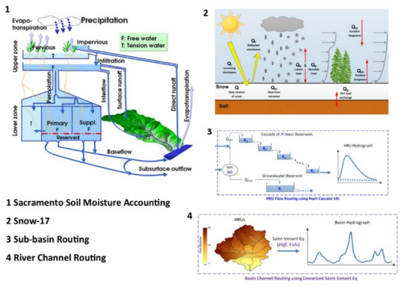
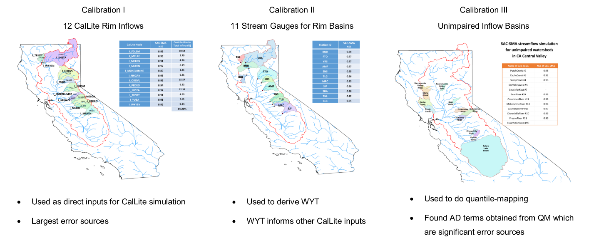

# SAC-SMA-DS Overview
SAC-SMA (Burnash et al. 1973), is a lumped conceptual hydrological model employed by the National Weather Service (NWS) of the National Oceanic and Atmospheric Administration (NOAA) to produce river and flash flood forecasts for the United States (Burnash 1995; McEnery et al. 2005). It was coupled with a river routing model (Lohmann et al. 1998) for application to the large, distributed CVS watershed system (consisting of approximately one thousand 1/8th degree grid cells). The coupled model is hereafter referred to as SAC-SMA-DS (Wi & Brown 2013), distinguishing it from the distributed version of SAC-SMA previously developed by NWS. SAC-SMA-DS has been applied to a number of case studies (e.g., Koren et al. 2004; Smith et al. 2004). SAC-SMA-DS (Figure 1) is composed of hydrologic process modules that represent soil moisture accounting, potential evapotranspiration (Hamon 1961), snow processes (Anderson 1976), and flow routing, and operates in grid formulation on a daily time-step.

The SAC-SMA-DS hydrologic model is used to simulate streamflow at 32 locations throughout the CVS watershed. As shown in Figure 2, these 32 streamflow simulations include:

- **Calibration Set I**: 12 rim inflows to major reservoirs throughout the area contributing runoff to the Sacramento-San Joaquin Delta.

- **Calibration Set II**: 11 gauging station streamflow points important for calculating water-year types used for regulatory constraints, management, and operational decision-making.

- **Calibration Set III**: 9 subbasin inflows that account for a substantial portion of the rain in the system and represent “unimpaired inflows,” as they are the modeling results of estimating the runoff that would have occurred had water flow remained unaltered in rivers and streams instead of stored in reservoirs, imported, exported, or diverted (Bay-Delta Office 2007).

# Run Instructions
Use the `batch-scripts/SAC_SMA_DS_All.m` to run user-selected sets of streamflows.

# References
Anderson EA. 1976. "A point energy and mass balance model of a snow cover" NOAA Tech. Rep. NSW
19, Natl. Oceanic and Atmos. Admin., Silver Spring, MD., 1-150.

Bay-Delta Office. 2007. California Central Valley Unimpaired Flow Data: 4th edition. California Department of Water Resources, 1-53.

Burnash, Robert JC, R. Larry Ferral, and Robert A. McGuire. A generalized streamflow simulation system: Conceptual modeling for digital computers. US Department of Commerce, National Weather Service, and State of California, Department of Water Resources, 1973.

Burnash, R. J. C. "The NWS river forecast system-catchment modeling." Computer models of watershed hydrology (1995): 311-366.

Hamon, W. R. (1961), Estimating potential evapotranspiration, J. Hydr. Eng. Div. -ASCE, 87, 107-120

McEnery, John, et al. "NOAA's advanced hydrologic prediction service: building pathways for better science in water forecasting." Bulletin of the American Meteorological Society 86.3 (2005): 375-386.

Lohmann, Dag, et al. "Regional scale hydrology: I. Formulation of the VIC-2L model coupled to a routing model." Hydrological sciences journal 43.1 (1998): 131-141.

# Contact
[Wyatt Arnold](mailto:wyatt.arnold@water.ca.gov) 
Engineer, Water Resources 
Climate Change Program 
California Department of Water Resources

# Disclaimer
> All information provided by the Department of Water Resources is made available to provide immediate access for the convenience of interested persons. While the Department believes the information to be reliable, human or mechanical error remains a possibility. Therefore, the Department does not guarantee the accuracy, completeness, timeliness, or correct sequencing of the information. Neither the Department of Water Resources nor any of the sources of the information shall be responsible for any errors or omissions, or for the use or results obtained from the use of this information.

